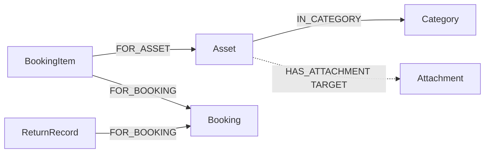

# Feasibility Study: KG-2 Equipment Stockpile Graph Modelling

| Field | Value |
|-------|--------|
| **Document type** | Graph / data-model feasibility study |
| **Status** | Complete (study). **As-built** populate + Bolt read exist; **canonical model below is the definition to align to.** |
| **Date** | 2026-08-30 |
| **Version** | 1.0.0 |
| **Graph** | **KG-2** — equipment stockpile (Neo4j). Distinct from **KG-1** (project-spec Ragas graph). |
| **Question** | What is the property-graph schema for KG-2 (labels, keys, properties, relationships), how does as-built populate differ, and how should Fleet Worker [6] read it? |
| **As-built code** | `deploy-pipeline/ansible/roles/haystack/files/populate_neo4j.py` · `app/agents/neo4j_tools.py` · fixture `tests/fixtures/recommend/neo4j_graph.json` |
| **SQL SoT** | Spring JPA → `postgres-primary` → sync → `postgres-haystack` ([`openspec/specs/spring-entity-repository/spec.md`](../openspec/specs/spring-entity-repository/spec.md) §5, §7) |
| **OpenSpec** | FR-KG-011 · [`../openspec/specs/knowledge-graph/spec.md`](../openspec/specs/knowledge-graph/spec.md) · [`../openspec/specs/knowledge-graph/design.md`](../openspec/specs/knowledge-graph/design.md) |
| **Related** | [`postgres-haystack-neo4j-realtime-sync.md`](./postgres-haystack-neo4j-realtime-sync.md) · [`recommender-matching-and-ner.md`](./recommender-matching-and-ner.md) · ADR-0012 |

> **Normative product rule:** KG-2 **must not** replace Asset SQL, Booking availability, or `predict_price()` on Call 2. It is a **fleet neighbor graph** for optional context (`neo4j_cypher_read` templates). Empty/unavailable → `[]` / Delegator K-3 skip.

---

## 1. Executive summary

| Question | Result |
|----------|--------|
| What is KG-2? | A **labelled property graph** of the rental fleet, projected from Postgres-Haystack into Neo4j |
| Identity of a machine? | `:Asset.id` = SQL `assets.id` (same as Call 2 quote `equipment.id`) |
| As-built nodes? | `:Asset`, `:Booking`, `:Category` (populate). App also **reads** `:Attachment`. Populate maps `return_records` → `:Return_Records` (not in app `FLEET_LABELS`) |
| As-built edges? | `(Asset)-[:IN_CATEGORY]->(Category)`, `(Booking)-[:FOR_ASSET]->(Asset)` **if** `booking.asset_id` exists |
| Does Spring have `bookings.asset_id`? | **No** — asset link is `booking_items.asset_id` |
| Canonical model? | **GO** — nodes/edges in §3; align populate + templates to **plural** Spring tables |
| Use KG-2 to pick `asset_id`? | **NO** (today and this study) |
| Mix with KG-1 `:Document`? | **NO** — fleet labels isolated; scoped delete never drops `:Document` |

**Overall:** define KG-2 as a **mirror of Spring FKs**, not a second catalog. As-built is a partial projection (singular table names, booking→asset edge on a column the ORM does not have, Attachment only in the fake fixture). Canonical modelling below is what “KG-2 graph modelling” should mean.

---

## 2. Role in the dual plane

```text
postgres-primary (Spring write SoT)
        │  sync T0–T2
        ▼
postgres-haystack / heavy_rental     ← Fleet SQL tools (authoritative for Call 2)
        │  neo4j-populate (ops sidecar, not uvicorn)
        ▼
Neo4j KG-2  :Asset :Category :Booking :BookingItem …
        │  neo4j_cypher_read (templates only)
        ▼
Fleet Worker [6] graph_notes         ← optional context AFTER SQL candidates exist
```

| Plane | Graph | Source | Lifetime | Recommend use |
|-------|--------|--------|----------|----------------|
| **KG-1** | Ragas document (optional NER transforms) | Call 1 project file | Session + JSON artifact | Worker [5] notes; Call 3 Q&A |
| **KG-2** | Neo4j fleet labels | Postgres-Haystack | Shared, persisted | Worker [6] neighbors; **not** quote identity/price |

Populate is **MERGE by `id`**, incremental or rebuild (label-scoped delete). `_source = fleet-mirror`, `_populated_at`.

---

## 3. Canonical graph model (definition)

Property graph: **nodes = Spring entities needed for fleet reasoning; edges = Spring FKs** (plus a small set of derived edges that SQL cannot express). Direction follows the child→parent FK unless a domain verb reads more naturally the other way (noted).

### 3.1 Diagram

```text
(:Category {id})  ←[:IN_CATEGORY]─  (:Asset {id})
                                          ▲
                                          │ :FOR_ASSET
                                          │
(:Booking {id}) ←[:FOR_BOOKING]─ (:BookingItem {id})
      ▲
      │ :FOR_BOOKING
      │
(:ReturnRecord {id})

TARGET (no Spring table today):
(:Asset)-[:HAS_ATTACHMENT]->(:Attachment)
(:Asset)-[:COMPATIBLE_WITH]->(:Attachment)

DERIVED (do not persist; query via IN_CATEGORY):
same-category peers
```

Mermaid equivalent:



### 3.2 Node labels

| Label | SQL table (Spring / haystack ORM) | Merge key | In v1 populate? |
|-------|-----------------------------------|-----------|-----------------|
| `:Category` | `asset_categories` | `id` | Partial — job looks for `public.category` |
| `:Asset` | `assets` | `id` (= quote `equipment.id`) | Partial — job looks for `public.asset` |
| `:Booking` | `bookings` | `id` | Partial — job looks for `public.booking` |
| `:BookingItem` | `booking_items` | `id` | **No** — **required for a correct FOR_ASSET story** |
| `:ReturnRecord` | `return_records` | `id` | Job maps `return_records` → `:Return_Records` (underscore, not in app labels) |
| `:Attachment` | **none** | `id` | **No** — fake fixture only |
| `:Document` | n/a (KG-1) | — | **Forbidden** on this plane |

**Out of KG-2 v1 (do not project):** `users`, `payments`, `rental_plan*`, `asset_images` (blob), `delivery_records`, `ai_recommendations`. Those are portal/PII/commercial SoT, not fleet neighborhood.

**Constraint (as-built populate already):** `CREATE CONSTRAINT fleet_<label>_id IF NOT EXISTS FOR (n:<Label>) REQUIRE n.id IS UNIQUE`.

### 3.3 Node properties (projection, not a second SoT)

Copy SQL scalars onto the node. Dates/decimals → ISO string / float (populate `coerce_value`). Do **not** invent graph-only commercial fields.

| Label | Required | Copied when present | Must not treat as Call 2 truth |
|-------|----------|---------------------|--------------------------------|
| `:Category` | `id`, `name` | — | — |
| `:Asset` | `id`, `name`, `category_id` | `capacity`, `platform_height`, `condition`, `description`, `purchase_year`, `location`, `serialno`, `min_daily_rate`, `max_daily_rate` | Guardrail rates ≠ `predict_price`; `name` is DTO `asset_id`, **`id` is quote PK** |
| `:Booking` | `id` | `start_date`, `end_date`, `status`, `total_amount`, `created_at`, `site_address` | Availability still from SQL `booking_items` + `return_records` |
| `:BookingItem` | `id`, `booking_id`, `asset_id` | `daily_rate`, `subtotal` | Realized line, not ML quote |
| `:ReturnRecord` | `id`, `booking_id` | `returned_at` | Ends a live hold (SQL path already) |
| `:Attachment` | `id`, `name` | `category` | TARGET until a table exists |

Internal: `_source = "fleet-mirror"`, `_populated_at` (job). Never copy columns whose names start with `_` from SQL without prefixing (`sql_…`).

### 3.4 Relationship types

| Type | Pattern | SQL origin | Cardinality | v1 |
|------|---------|------------|-------------|-----|
| `IN_CATEGORY` | `(:Asset)-[:IN_CATEGORY]->(:Category)` | `assets.category_id` | N:1 | **As-built** if `category_id` column found |
| `FOR_ASSET` | `(:BookingItem)-[:FOR_ASSET]->(:Asset)` | `booking_items.asset_id` | N:1 | **Canonical.** As-built wrongly uses `(:Booking)-[:FOR_ASSET]->(:Asset)` from `booking.asset_id` |
| `FOR_BOOKING` | `(:BookingItem)-[:FOR_BOOKING]->(:Booking)` | `booking_items.booking_id` | N:1 | **Canonical; not as-built** |
| `FOR_BOOKING` | `(:ReturnRecord)-[:FOR_BOOKING]->(:Booking)` | `return_records.booking_id` | N:1 | **Canonical; label must be `:ReturnRecord`** |
| `HAS_ATTACHMENT` | `(:Asset)-[:HAS_ATTACHMENT]->(:Attachment)` | no table | N:M | TARGET / fake fixture |
| `COMPATIBLE_WITH` | `(:Asset)-[:COMPATIBLE_WITH]->(:Attachment)` | no table | N:M | TARGET (template `compatible_attachments`) |
| `SAME_CATEGORY` | `(:Asset)-[:SAME_CATEGORY]->(:Asset)` | derived | N:N | **Do not persist** — query `MATCH (a:Asset)-[:IN_CATEGORY]->(:Category)<-[:IN_CATEGORY]-(b:Asset)` |

No relationship properties required in v1. Do not store `available` or `daily_rate` on edges.

### 3.5 Identity and lookup

| Question | Answer |
|----------|--------|
| Graph node id | SQL PK (`Long` → Neo4j integer or string; Bolt mapper stringifies) |
| Quote `equipment.id` | `:Asset.id` |
| Fleet tool DTO `asset_id` | `:Asset.name` (UNIQUE in Spring) |
| Neighbor template key | `asset_id` argument today is catalog/name **or** graph id — **canonical: pass `assets.id`** (same as quote) |
| Category filter | Prefer `IN_CATEGORY` to `:Category.name`; as-built `assets_by_category` uses node property `category` string |

### 3.6 Example (canonical)

Need: scissors, window Sep 2026. Asset `12` in category `3` (Scissors Lift), booking item `40` on booking `9`.

```cypher
MERGE (c:Category {id: 3}) SET c.name = 'Scissors Lift';
MERGE (a:Asset {id: 12})
  SET a.name = 'SL-12', a.category_id = 3, a.platform_height = 12.0, a.condition = 'EXCELLENT';
MERGE (a)-[:IN_CATEGORY]->(c);
MERGE (b:Booking {id: 9})
  SET b.start_date = '2026-09-01', b.end_date = '2026-09-15', b.status = 'CONFIRMED';
MERGE (bi:BookingItem {id: 40}) SET bi.booking_id = 9, bi.asset_id = 12;
MERGE (bi)-[:FOR_BOOKING]->(b);
MERGE (bi)-[:FOR_ASSET]->(a);
```

**Eligibility for recommend is still SQL.** Graph walk for context:

```cypher
MATCH (a:Asset {id: 12})-[r]-(n)
WHERE NOT 'Document' IN labels(n)
RETURN type(r), labels(n), n.id
```

That is the allowlisted idea behind `asset_neighbors`.

---

## 4. As-built vs canonical (gaps)

| Topic | As-built | Canonical (§3) |
|-------|----------|----------------|
| SQL table names | `asset`, `booking`, `category` (singular) | `assets`, `bookings`, `asset_categories` (Spring / haystack ORM) |
| Booking–asset edge | `MATCH (b:Booking)-[:FOR_ASSET]->(a:Asset)` from `booking.asset_id` | `BookingItem` node + `FOR_ASSET` / `FOR_BOOKING` |
| `booking_items` | Not projected | **Required** |
| Attachments | App `FLEET_LABELS` includes `Attachment`; fixture `HAS_ATTACHMENT` / `SAME_CATEGORY` | TARGET until a table exists; drop persisted `SAME_CATEGORY` |
| Return | `:Return_Records` if table `return_records` | `:ReturnRecord` + `FOR_BOOKING` |
| App read labels | `{Asset, Booking, Category, Attachment}` | Add `BookingItem`, `ReturnRecord`; Attachment remains optional |
| Isolation | Fleet MATCH excludes `:Document` | **Keep** |
| Recommend | Neighbors after SQL candidates | **Keep** — graph does not pick the winner |

These gaps match the already-noted pack vs ORM table-name follow-up (implementation-plan S4). The **semantic** gap is larger: **without `booking_items`, KG-2 cannot represent holds.**

---

## 5. Query templates (Fleet Worker [6])

Allowlisted only — no free-form Cypher (`app/agents/neo4j_tools.py`).

| Template | Canonical Cypher intent | Today |
|----------|-------------------------|--------|
| `asset_neighbors` | 1-hop from `:Asset {id}` over fleet labels | In-memory hop on loaded graph; mixed id/name |
| `assets_by_category` | `:Asset)-[:IN_CATEGORY]->(:Category {name})` | Filter `node.category` string |
| `compatible_attachments` | `HAS_ATTACHMENT` / `COMPATIBLE_WITH` | Same hop, rel-type filter; **empty unless fixture** |

K-3: empty graph or Bolt down → skip tool; SQL fleet still runs.

**Do not add** a template that returns “the recommended asset.” That remains filter + availability + price + rank (or a later proof axiom).

---

## 6. Mapping to recommend / proof (later)

If Call 2 ever emits a **proof from premises**, KG-2 can supply **fleet premises**, not the verdict:

| Premise | Graph | Still authoritative in SQL? |
|---------|--------|-----------------------------|
| `type(asset)=scissor lift` | `IN_CATEGORY` → `Category.name` | Yes (catalog) |
| `height(asset)≥10` | `:Asset.platform_height` | Yes (`assets`) |
| `¬available(asset, window)` | path `Asset←FOR_ASSET-BookingItem-FOR_BOOKING→Booking` with overlapping dates, no `ReturnRecord.returned_at` | **Yes — must stay SQL for the quote** |
| `price(asset)=r` | **Not a graph edge** | `predict_price()` oracle |

KG-1 project entities (NER) **must not** be MERGEd into these labels.

---

## 7. Invariants (do not violate)

1. KG-1 and KG-2 stay **disjoint label sets**. Rebuild/orphan-delete is fleet-label scoped.  
2. Write SoT remains **Spring Postgres**. Neo4j is a **lossy projection**.  
3. Call 2 `equipment.id` / rates / availability come from **SQL + pricing tools**, not from a graph walk.  
4. Templates only; free-form Cypher rejected.  
5. Populate never runs inside the FastAPI request worker (ops sidecar + `NEO4J_POPULATE_URL`).  
6. Default CI: `NEO4J_BACKEND=fake` (empty unless fixture).  
7. No user/PII nodes in v1.  
8. Do not persist derived `SAME_CATEGORY`.  
9. `:Asset.id` uniqueness = SQL PK; do not MERGE assets on `name`.

---

## 8. Phasing

| Step | Work | Status |
|------|------|--------|
| **G0** | This definition | **This document** |
| **G1** | Point populate at **plural** tables (`assets`, `bookings`, `asset_categories`, `booking_items`, `return_records`) | **Not started** (pack alignment) |
| **G2** | Project `:BookingItem`; move `FOR_ASSET` off `:Booking`; add `FOR_BOOKING`; rename `:ReturnRecord` | **Not started** |
| **G3** | App `FLEET_LABELS` + mapper + templates use `assets.id`; tests against a canonical fixture | **Not started** |
| **G4** | Attachment catalog table or drop `compatible_attachments` until then | TARGET |
| **G5** | Optional: Cypher-side templates on Bolt instead of loading the full fleet subgraph | TARGET |

G1–G3 are a **populate + tool** change, not a recommend rewrite.

---

## 9. Non-goals

- Using Neo4j as availability or pricing engine.  
- Ragas `KnowledgeGraphGenerator` for fleet (that is KG-1).  
- Project-spec nodes in Neo4j.  
- Users, payments, images, recommendation_items in KG-2 v1.  
- Free-form agent Cypher.

---

## 10. Document control

| Version | Date | Notes |
|---------|------|--------|
| **1.0.0** | 2026-08-30 | Canonical KG-2 labels/keys/edges; as-built vs Spring FK map; BookingItem required; Attachment TARGET |

---

## 11. One-page decision card

| Decision | Recommendation |
|----------|----------------|
| Graph type | Labelled property graph in Neo4j |
| Node identity | SQL PK `id`; `:Asset.id` = quote `equipment.id` |
| Core nodes | `Category`, `Asset`, `Booking`, `BookingItem`, `ReturnRecord` |
| Core edges | `IN_CATEGORY`, `FOR_ASSET` (from **item**), `FOR_BOOKING` |
| Attachment | TARGET; fixture-only today |
| Derived same-category | Query, do not store |
| Populate | MERGE projection from Postgres-Haystack; isolate `:Document` |
| Read | Allowlisted templates; K-3 skip |
| Call 2 authority | SQL + `predict_price`, **not** KG-2 |
| First alignment | Plural table names + `booking_items` (G1–G2) |
